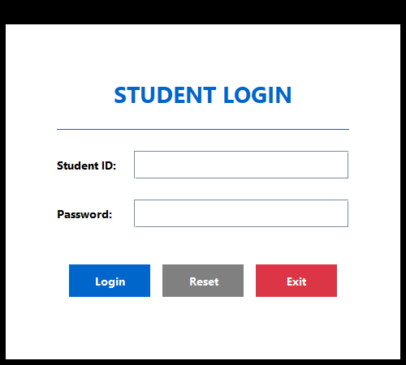
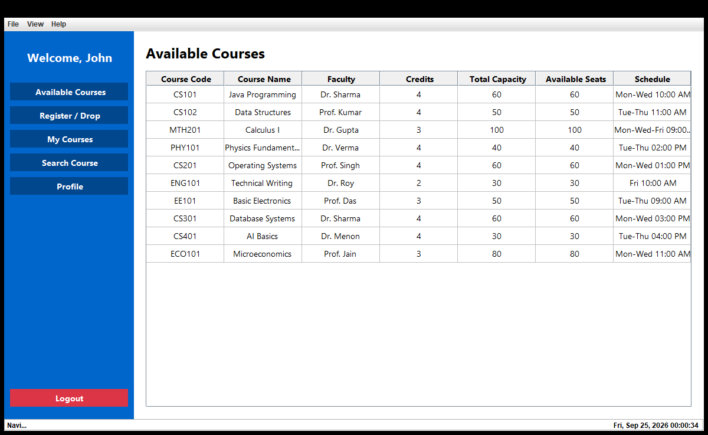
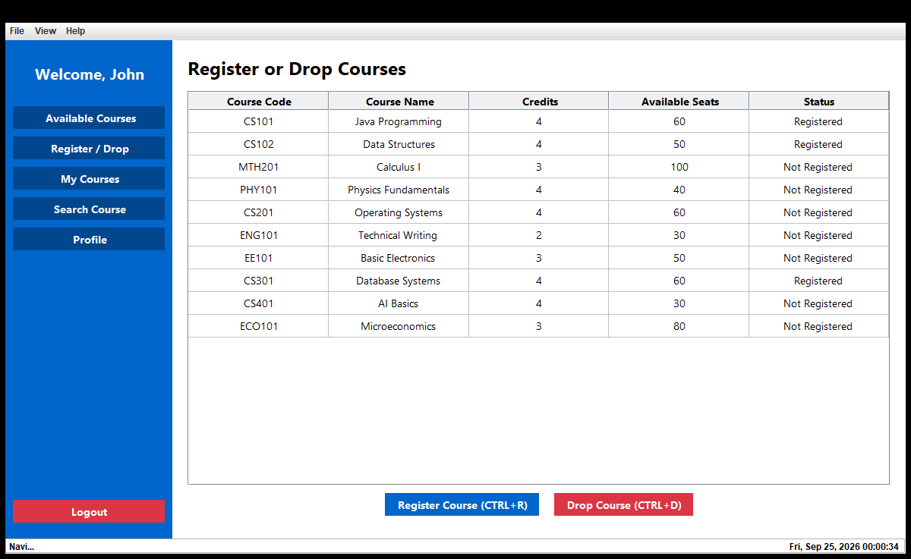
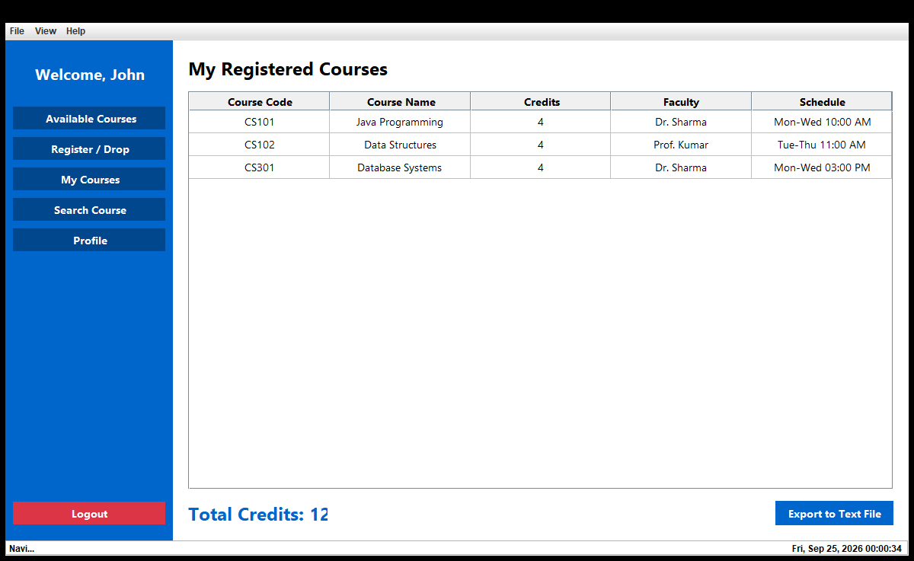
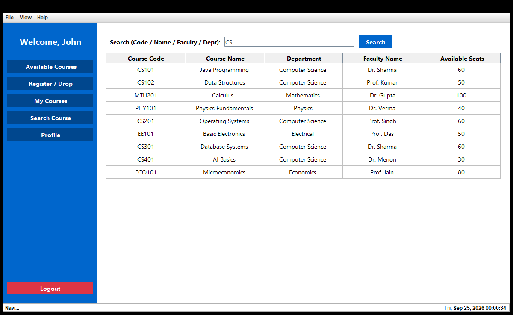
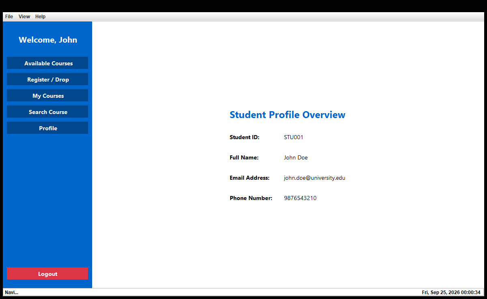
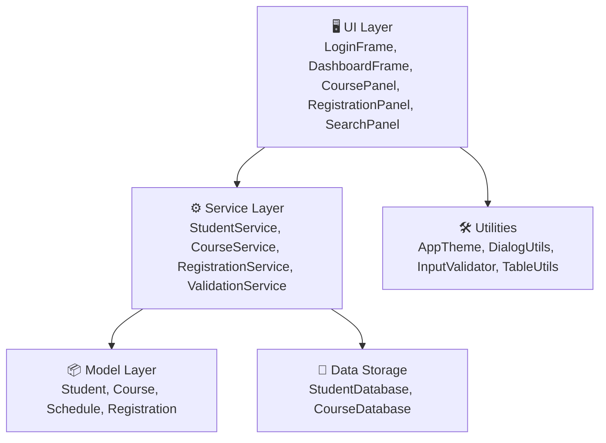

# 🎓 Student Course Registration System

[](https://www.oracle.com/java/)
[](https://docs.oracle.com/javase/tutorial/uiswing/)
[](https://github.com/rupampatle25/StudentCourseRegistrationSystem)
[](https://www.codsoft.in/)

A modular desktop application developed in **Java (Swing)** for university students to register and manage their course curriculum. The application provides an interactive Graphical User Interface (GUI) featuring student authentication, available course listings, dynamic seat allocation, course registration & drop handling, credit tracking, search filtering, and course list export.

Developed as part of the **CodSoft Java Development Internship (Task 5)**.

---

## 📌 Table of Contents
- [✨ Key Features](#-key-features)
- [📸 Screenshots](#-screenshots)
- [🏛️ System Architecture](#️-system-architecture)
- [🔑 Login Credentials](#-login-credentials)
- [⌨️ Keyboard Shortcuts](#️-keyboard-shortcuts)
- [🚀 Getting Started](#-getting-started)
  - [Prerequisites](#prerequisites)
  - [Method 1: One-Click Execution (Windows)](#method-1-one-click-execution-windows)
  - [Method 2: VS Code (F5 Run & Debug)](#method-2-vs-code-f5-run--debug)
  - [Method 3: Terminal / Command Prompt](#method-3-terminal--command-prompt)
- [📂 Directory Structure](#-directory-structure)
- [🛡️ Validations & Business Rules](#️-validations--business-rules)
- [👤 Author](#-author)

---

## ✨ Key Features

- **🔐 Dual Student Authentication:**
  - Secure login with pre-configured accounts (`STU001`, `STU002`).
  - Dynamic on-the-fly student account registration for any newly entered Student ID.
  
- **📋 Available Course Catalog:**
  - Displays comprehensive course details: Course Code, Course Name, Faculty Name, Credits, Capacity, Real-time Available Seats, and Weekly Lecture Schedule.

- **⚡ Course Registration & Drop:**
  - Immediate registration with a single click or keyboard shortcut.
  - Live seat capacity synchronization (auto-decrements upon registration and increments upon dropping).
  - Safety validations preventing duplicate enrollments and registration beyond maximum allowed courses.

- **📊 My Courses & Credit Sum:**
  - Dedicated student overview displaying all currently enrolled courses and lecture timings.
  - Automatic dynamic calculation of cumulative enrolled credit hours.
  - **Export to File:** Export enrolled courses schedule directly into an official text summary file.

- **🔍 Multi-field Search Filter:**
  - Instant query matching against Course Code, Title, Department, or Instructor name.

- **🎨 Modern UI & Responsive Layout:**
  - Clean card-layout sidebar navigation.
  - Cross-platform styling with high-DPI font scaling and Windows button rendering fixes.
  - Real-time digital clock in status bar.

---

## 📸 Screenshots

| 1. Student Login Screen | 2. Available Courses Catalog |
| :---: | :---: |
|  |  |

| 3. Register & Drop Management | 4. Enrolled Courses & Credit Summary |
| :---: | :---: |
|  |  |

| 5. Multi-Attribute Course Search | 6. Student Profile Overview |
| :---: | :---: |
|  |  |

---

## 🏛️ System Architecture

The application adopts a clean, layered architecture separating UI presentation, business validation logic, and data storage:



### Module Responsibilities

| Package | Class / File | Description |
| :--- | :--- | :--- |
| **`app`** | [`Main.java`](src/app/Main.java) | Application entry point; initializes theme and loads `LoginFrame` on Swing EDT. |
| **`model`** | [`Course.java`](src/model/Course.java) | Course entity with code, name, capacity, available seats, credits, and schedule. |
| | [`Student.java`](src/model/Student.java) | Student entity holding enrolled course lists and personal details. |
| | [`Schedule.java`](src/model/Schedule.java) | Class timing and meeting days representation. |
| | [`Registration.java`](src/model/Registration.java) | Association model recording student-course registration events. |
| **`service`** | [`CourseService.java`](src/service/CourseService.java) | Course querying and multi-attribute search filtering. |
| | [`RegistrationService.java`](src/service/RegistrationService.java) | Seat updates, registration logic, and credit calculation. |
| | [`StudentService.java`](src/service/StudentService.java) | Credential authentication and dynamic student account generation. |
| | [`ValidationService.java`](src/service/ValidationService.java) | Capacity checks, duplicate registration guards, and drop validation. |
| **`ui`** | [`LoginFrame.java`](src/ui/LoginFrame.java) | User authentication form with responsive inputs and keyboard listeners. |
| | [`DashboardFrame.java`](src/ui/DashboardFrame.java) | Master navigation frame utilizing `CardLayout` for panel switching. |
| | [`CoursePanel.java`](src/ui/CoursePanel.java) | Table view of all university offerings. |
| | [`RegistrationPanel.java`](src/ui/RegistrationPanel.java) | Course registration and drop interface with live status tags. |
| | [`MyCoursesPanel.java`](src/ui/MyCoursesPanel.java) | Active course list, credit count, and text file export. |
| | [`SearchPanel.java`](src/ui/SearchPanel.java) | Real-time course search engine. |
| | [`ProfilePanel.java`](src/ui/ProfilePanel.java) | Displays current logged-in student metadata. |
| **`utils`** | [`AppTheme.java`](src/utils/AppTheme.java) | Theme definitions and Look & Feel configuration. |
| | [`TableUtils.java`](src/utils/TableUtils.java) | Centralized table row height, header styling, and cell alignment. |
| | [`InputValidator.java`](src/utils/InputValidator.java) | Form validation and boundary checking. |
| | [`DialogUtils.java`](src/utils/DialogUtils.java) | Reusable error, info, and confirmation modal dialogs. |

---

## 🔑 Login Credentials

The system includes pre-populated student records and dynamically registers any unrecognized ID:

| Student ID | Password | Student Name | Role / Action |
| :--- | :--- | :--- | :--- |
| `STU001` | `1234` | John Doe | Pre-configured Student |
| `STU002` | `pass` | Jane Smith | Pre-configured Student |
| *Any New ID* | *Any Password* | Student (*ID*) | Automatically creates new student profile on login |

---

## ⌨️ Keyboard Shortcuts

| Shortcut | Scope | Action |
| :--- | :--- | :--- |
| <kbd>Enter</kbd> | Login Dialog | Submit login credentials |
| <kbd>Esc</kbd> | Login Dialog | Exit application |
| <kbd>Ctrl</kbd> + <kbd>R</kbd> | Dashboard | Quickly switch to **Register Course** view |
| <kbd>Ctrl</kbd> + <kbd>D</kbd> | Dashboard | Quickly switch to **Drop Course** view |
| <kbd>Enter</kbd> | Search Panel | Trigger instant search execution |

---

## 🚀 Getting Started

### Prerequisites
- **Java Development Kit (JDK):** Version 8 or higher (JDK 17 or 21 recommended).
- Verify your Java installation:
  ```bash
  javac -version
  java -version
  ```

---

### Method 1: One-Click Execution (Windows)

Double-click `run.bat` or run the following in PowerShell:
```powershell
.\run.ps1
```

---

### Method 2: VS Code (F5 Run & Debug)

1. Open this repository folder in **Visual Studio Code**.
2. Ensure the **Extension Pack for Java** extension is installed.
3. Open `src/app/Main.java`.
4. Press <kbd>F5</kbd> or click the **Run** code lens button.

---

### Method 3: Terminal / Command Prompt

1. **Clone the repository:**
   ```bash
   git clone https://github.com/rupampatle25/StudentCourseRegistrationSystem.git
   cd StudentCourseRegistrationSystem
   ```

2. **Compile the source code:**
   - **Command Prompt (cmd):**
     ```cmd
     if not exist bin mkdir bin
     dir /s /b src\*.java > sources.txt
     javac -encoding UTF-8 -d bin @sources.txt
     del sources.txt
     ```
   - **PowerShell:**
     ```powershell
     if (!(Test-Path "bin")) { New-Item -ItemType Directory -Path "bin" }
     $files = (Get-ChildItem -Recurse -Filter *.java src).FullName
     javac -encoding UTF-8 -d bin $files
     ```

3. **Launch the Application:**
   ```bash
   java -cp bin app.Main
   ```

---

## 📂 Directory Structure

```text
StudentCourseRegistrationSystem/
├── .vscode/                     # VS Code workspace launch & build configurations
│   ├── launch.json
│   ├── settings.json
│   └── tasks.json
├── screenshots/                 # Application preview screenshots
│   ├── 01_login_screen.png
│   ├── 02_available_courses.png
│   ├── 03_course_registration.png
│   ├── 04_my_courses.png
│   ├── 05_search_course.png
│   └── 06_student_profile.png
├── src/
│   ├── app/
│   │   └── Main.java            # Entry point
│   ├── data/
│   │   ├── CourseDatabase.java  # In-memory course store
│   │   └── StudentDatabase.java # In-memory student store
│   ├── model/
│   │   ├── Course.java          # Course domain model
│   │   ├── Registration.java    # Registration entity
│   │   ├── Schedule.java        # Class schedule entity
│   │   └── Student.java         # Student domain model
│   ├── service/
│   │   ├── CourseService.java   # Course search & retrieval
│   │   ├── RegistrationService.java # Enrollment and drop business logic
│   │   ├── StudentService.java  # Student authentication
│   │   └── ValidationService.java # Business validation rules
│   ├── ui/
│   │   ├── CoursePanel.java     # Available courses UI
│   │   ├── DashboardFrame.java  # Main dashboard window
│   │   ├── LoginFrame.java      # Login interface
│   │   ├── MyCoursesPanel.java  # Registered courses UI & file export
│   │   ├── ProfilePanel.java    # Student profile overview
│   │   ├── RegistrationPanel.java # Registration / Drop interface
│   │   ├── SearchPanel.java     # Course search interface
│   │   └── UIConstants.java     # Color palette & font definitions
│   └── utils/
│       ├── AppTheme.java        # Look & Feel manager
│       ├── DialogUtils.java     # Swing dialog helpers
│       ├── InputValidator.java  # Credential validator
│       ├── ScreenshotGenerator.java # Automated UI capture utility
│       └── TableUtils.java      # JTable formatting utilities
├── run.bat                      # One-click Windows CMD script
├── run.ps1                      # One-click PowerShell script
├── .gitignore                   # Git ignore file
└── README.md                    # Project documentation
```

---

## 🛡️ Validations & Business Rules

1. **Course Capacity Constraints:** A student cannot register for a course if its available seats reach zero.
2. **Duplicate Prevention:** A student cannot register for the same course more than once.
3. **Course Limit:** A maximum limit of 5 courses per student is enforced to prevent overload.
4. **Accurate Seat Counter:** Registering automatically decrements available capacity, and dropping returns the seat to the university pool immediately.

---

## 👤 Author

- **Rupam Patle**
- GitHub: [@rupampatle25](https://github.com/rupampatle25)
- Project Repository: [StudentCourseRegistrationSystem](https://github.com/rupampatle25/StudentCourseRegistrationSystem)

---

⭐ *If you found this project helpful, feel free to give it a star!*
